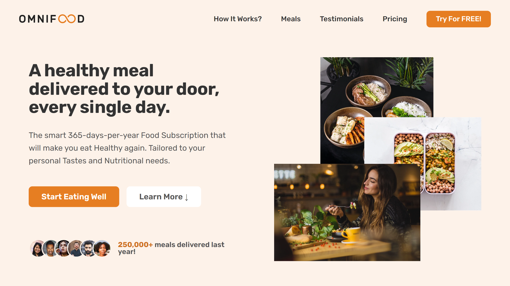

# Omnifood

## About Omnifood

We are a Technology Company first, but with a major focus on Consumer Well-Being through a Healthy Diet. Most people are very Busy with their Jobs, Family and Friends, and other important Activities, which doesn't leave much time for Cooking. This might lead to a poor Diet and lasting Health Consequences. We want to Solve this Problem by using an AI-Centric approach. Users can use our Application to select their Diet and Foods they Like and Dislike, and our AI Algorithm will create a Custom and Individual Weekly Meal Plan. But we don't stop there. We partner with Restaurants and other Cooking Partners to actually Cook and Deliver all Meals from the generated Meal Plans, in selected Cities. All this will be packed up in a Monthly Subscription, where users can choose between receiving One or Two Meals Per Day, every Single Day of the Month.

## Branding

- Headline : A healthy meal delivered to your door, every single day.

- Brand Color : #e67e22

## Omnifood Website Content

### Summary

The smart 365-days-per-year Food Subscription that will make you eat Healthy again. Tailored to your personal Tastes and Nutritional needs. We have delivered 250,000+ meals last year!

### Omnifood Features

Never cook again! : Our subscriptions cover 365 days-per-year, even including major Holidays.
Local and Organic : Our cooks only use Local, Fresh, and Organic products to prepare your Meals.
No waste : All our partners only use reusable containers to package all your Meals.
Pause anytime : Going on vacation? Just pause your Subscription, and we refund unused days.

### How Omnifood Works?

> Your daily dose of health in 3 simple steps

- Tell us what you like (and what not) : Never again waste time thinking about what to eat! Omnifood AI will create a 100% personalized weekly meal plan just for you. It makes sure you get all the nutrients and vitamins you need, no matter what diet you follow!

- Approve your weekly meal plan : Once per week, approve the meal plan generated for you by Omnifood AI. You can change ingredients, swap entire meals, or even add your own recipes.

- Receive meals at convenient time : Best chefs in town will cook your selected meal every day, and we will deliver it to your door whenever works best for you. You can change delivery schedule and address daily!

### Omnifood works with any diet ;)

Vegetarian,
Vegan,
Pescatarian,
Gluten-Free,
Lactose-Free,
Keto,
Paleo,
Low FODMAP,
Kid-Friendly.

### Sample Meals

> Omnifood AI chooses from 5,000+ recipes

Meal 1 : Japanese Gyozas

- Category : Vegetarian
- Calories : 650
- NutriScore (Registered) : 74
- Average Rating : 4.9
- Number Reviews : 369

Meal 2 : Avocado Salad

- Category : Vegan and Paleo
- Calories : 400
- NutriScore (Registered) : 92
- Average Rating : 4.8
- Number Reviews : 357

### We offer a free sample meal

Healthy, tasty and hassle-free meals are waiting for you. Start eating well today. You can cancel or pause anytime. And the first meal is on us!

### We have 2 pricing plans

Prices include all applicable Taxes. Users can Cancel at any Time.

Starter : ₹9001 per month

- 1 meal per Day
- Order times are between 11 AM and 9 PM
- Delivery is Free!

Complete : ₹15001 per month

- 2 meals per Day
- Order 24/7
- Delivery is Free!
- Get access to Latest Recipes

### Photo Gallery

### Customer Testimonials

- Inexpensive, healthy and great-tasting meals, without even having to order manually! It feels truly magical. (Dave Bryson)
- The AI algorithm is crazy good, it chooses the right meals for me every time. It's amazing not to worry about food anymore! (Ben Hadley)
- Omnifood is a life saver! I just started a company, so there's no time for cooking. I couldn't live without my daily meals now! (Steve Miller)
- I got Omnifood for the whole family, and it frees up so much time! Plus, everything is organic and vegan and without plastic. (Hannah Smith)

### Contact Information

- Address : 7/E Hangseswari Road, Bansberia, Hooghly, West Bengal, India - 712502.
- Contact Number : +91-7003384387
- eMail : support@omnifood.com

Social Profiles : [Facebook](https://www.facebook.com/NitinChakraborty2001/), [Instagram](https://www.instagram.com/NitinChakraborty2001/), [Twitter](https://www.twitter.com/NitinCB2001/).

### Additional Links

- Sign In
- Create Account
- Android Application
- iOS Application

- About Omnifood
- For Business
- Careers
- Cooking Partners

- Help Center
- Privacy & Terms
- Recipe Directory

## Sections

- Logo + Navigation
- Hero
- Featured In
- How It Works?
- Meals
- Testimonials + Gallery
- Pricing + Features
- Call To Action
- Footer
